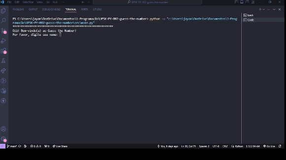
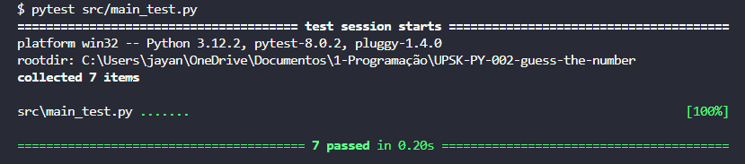

# Guess the Number - Python 🐍

## Índice

* [1. Prefácio](#1-prefácio)
* [2. Resumo do projeto](#2-resumo-do-projeto)
* [3. Demonstração de uso](#3-demonstração-de-uso)
* [4. Guia Prático de Instalação e Uso](#4-guia-prático-de-instalação-e-uso)
* [5. Testes Unitários](#5-testes-unitários)
* [6. Critérios Minímos de Aceitação do Projeto](#6-criterios-minimos-de-aceitação-do-projeto)
* [7. Especificações Técnicas](#7-especificações-técnicas)
* [8. Implementações futuras](#8-implementações-futuras)
* [9. Desenvolvedora](#9-desenvolvedora)

---


## 1. Prefácio

O projeto Guess the Number é uma introdução divertida ao mundo da programação Python, especialmente focado no desenvolvimento de habilidades em lógica de programação. Desenvolvido como parte do programa prático intensivo de Python pela equipe de bootcamp da Laboratoria, este consiste em um projeto de nível 1 com objetivos de aprendizagem concretos. Ele oferece uma oportunidade valiosa para explorar os conceitos fundamentais da linguagem Python, especialmente em relação à lógica de programação.

Neste projeto, os participantes têm a tarefa de criar um jogo que ocorre no terminal, onde os jogadores tentam adivinhar um número aleatório gerado pelo computador. Utilizando estruturas de controle como loops e condicionais, os desenvolvedores aprendem a aplicar a lógica de programação de maneira prática e interativa.

## 2. Resumo do projeto
_Guess the Number_ é um jogo interativo que ocorre no terminal, onde o jogador e o computador competem para adivinhar um número aleatório entre 1 e 100. Durante o jogo, ambos os participantes devem considerar as tentativas anteriores e se foram classificadas como "palpite maior" ou "palpite menor" para ajustar suas estratégias de adivinhação. Este jogo oferece uma experiência divertida e desafiadora, testando a habilidade de dedução do jogador e a lógica do algoritmo do computador.

### Principais Características: 

* **Geração de Número Aleatório:** O jogo implementa a geração de um número aleatório entre 1 e 100, proporcionando variedade a cada partida.

* **Interação com o Jogador:** Utiliza um loop para solicitar que o jogador faça suas suposições, proporcionando uma experiência interativa.

* **Comparação e Dicas:** Compara a entrada do jogador com o número secreto e fornece dicas se a suposição estiver incorreta, auxiliando o jogador a chegar mais perto da resposta correta.

* **Lógica do Computador:** Implementa uma estratégia para que o computador faça suas suposições, tornando o jogo desafiador e interessante.

* **Continuidade do Jogo:** Permite que o jogo continue até que o jogador ou o computador adivinhem corretamente o número, garantindo uma experiência completa de jogo.

* **Registro de Suposições:** Mantém um registro das suposições feitas pelo jogador e pelo computador, proporcionando uma visão detalhada do progresso do jogo.

* **Número de Tentativas:** Revela quantas tentativas o jogador precisou para adivinhar corretamente o número secreto, destacando sua eficiência e habilidade no jogo.

* **Opção de Jogar Novamente:** Oferece ao jogador a opção de jogar novamente após o término do jogo, aumentando a diversão e emoção.

## 3. Demonstração de Uso 

**_Divirta-se jogando o Guess the Number! 🎲🎮_**

<div align="center">
 <br>
</div>

## 4. Guia Prático de Instalação e Uso

### 4.1 Instalação

**4.1.1. Clone o Repositório ou Baixe o Arquivo do Script:**
* Se você estiver familiarizado com o Git, pode clonar o repositório usando o seguinte comando:
```
git clone https://github.com/jay-santana/UPSK-PY-002-guess-the-number.git
```
* Ou, se preferir, baixe diretamente o arquivo do script do jogo [aqui](https://github.com/jay-santana/UPSK-PY-002-guess-the-number?tab=readme-ov-file).

**4.1.2. Certifique-se de ter o Python instalado em seu sistema:**
* Verifique se o Python está instalado em seu sistema digitando o seguinte comando no terminal:
```
python --version
```
* Se o Python não estiver instalado, você pode baixá-lo e instalá-lo a partir do [site oficial](https://docs.pytest.org/en/8.0.x/getting-started.html#install-pytest).

**4.1.3. Execute o Script:**
* Navegue até o diretório onde você baixou/clonou o repositório usando o terminal.

* Execute o script `SAP011-guess-the-number.py` digitando o seguinte comando:
```
python SAP011-guess-the-number.py
```

### 4.2 Uso
**4.2.1. Siga as Instruções no Terminal para Jogar o Jogo:**
* Uma vez que o script seja executado, siga as instruções exibidas no terminal para jogar o "Guess the Number".

* Você será solicitado a inserir um nome de jogador e fazer palpites.

* Continue jogando até que você ou o computador adivinhe corretamente o número secreto.

## 5. Testes Unitários

Para este projeto foram desenvolvidos testes unitários utilizando a biblioteca de testes PyTest e simulação de geração de números aleatórios com unittest.mock. 
Os testes unitários realizados obtiveram uma cobertura de 100% das functions (funções).

<p>

</p>

## 6. Critérios Mínimos de Aceitação do Projeto

* [x] Iniciar o jogo com o jogador e o computador se revezando em turnos para tentar adivinhar o número.
* [x] Apresentar após cada tentativa:
  * O nome do jogador (pessoa ou computador).
  * A suposição feita.
  * Uma mensagem indicando se a suposição foi muito alta, muito baixa ou
    correta.
* [x] Terminar o jogo quando o jogador ou o computador adivinhar o número secreto. 
* [x] Exibir uma mensagem de fim de jogo. 
* [x] Mostrar uma lista de todas as tentativas feitas pelo jogador vencedor.

## 7. Especificações Técnicas

O projeto foi desenvolvido utilizando como ferramentas e tecnologias:

* Python
* PyTest
* Unittest.mock 
* GitHub
* Git Bash
* Trello

## 8. Implementações futuras

* Criar uma "inteligência" para jogar contra o computador, utilizando uma biblioteca de
aprendizado de máquina como scikit-learn.
* Adicionar testes unitários para a nova "inteligência".
* Criar uma extensão utilizando o paradigma da Programação Orientada a Objetos (OOP).

## 9. Desenvolvedora

Jayanny Santana

* GitHub: [@jay-santana](https://github.com/jay-santana)
* Linkedin: [Jayanny Santana](https://www.linkedin.com/in/jayanny-santana/)
